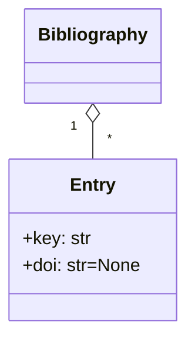

# Context Specification

This document specifies the context of the **BibTex Duplicate Detector** system.

## Scope

The scope of the BibTex Duplicate Detector system is to provide support to researchers managing a large bibliography file in `.bibtex` format by identifying duplicate entries.

## Domain Model

When researchers write scientific articles, they often maintain a bibliography in a `.bibtex` file.
This text file contains multiple entries in the BibTex format, which can look as follows:[^1]

```bibtex
@article{frattini2023requirements,
	title={Requirements quality research: a harmonized theory, evaluation, and roadmap},
	  author={Frattini, Julian and Montgomery, Lloyd and Fischbach, Jannik and Mendez, Daniel and Fucci, Davide and Unterkalmsteiner, Michael},
	  journal={Requirements Engineering},
	  pages={1--14},
	  year={2023},
	  publisher={Springer},
	  doi={10.1007/s00766-023-00405-y}
}
```

The `@article` prefix encapsulates one article.
Every article has a `key` (in the example above: "frattini2023requirements") and several fields.
One of the fields is the digital object identifier (DOI), an ID that is unique to every article ever published.
This field is, however, optional.
The objects relevant to this domain can be visualized as follows:



Sometimes, due to long projects or extensive collaborations, bibliographys may contain the same article multiple times.
This usually triggers warnings in LaTeX compilers, which researchers want to avoid.

## Objectives and Goals

The system has the following goals (formulated using the Connextra template "As a \<role\> I want to \<goal\> in order to \<benefit\>."):

- **G1**: As a _researcher_ I want to _identify duplicate entries in my BibTex file_ in order to _remove them_.

[^1]: For a larger example, take a look at the [data/references.bib](../data/references.bib) file.