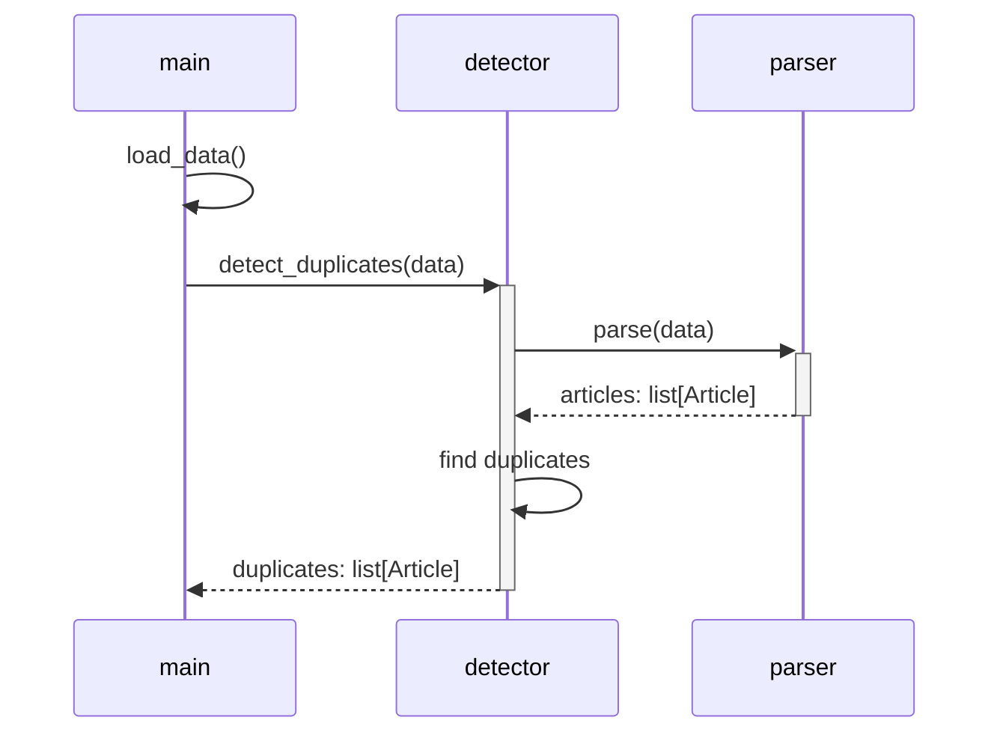

# System Specification

This document describes how the system shall be realized to achieve the goal outlined in the [requirements specification](requirements-specification.md).

## Main Function

The main functionality of the system shall be realized through the communication of a set of Python scripts.
These scripts should delegate the work in the following manner.

Initially, the `main` component may simply print the resulting list of duplicates.
Later, it shall be used as one component within a larger system and the list of duplicates shall be visualized in a graphical user interface.
